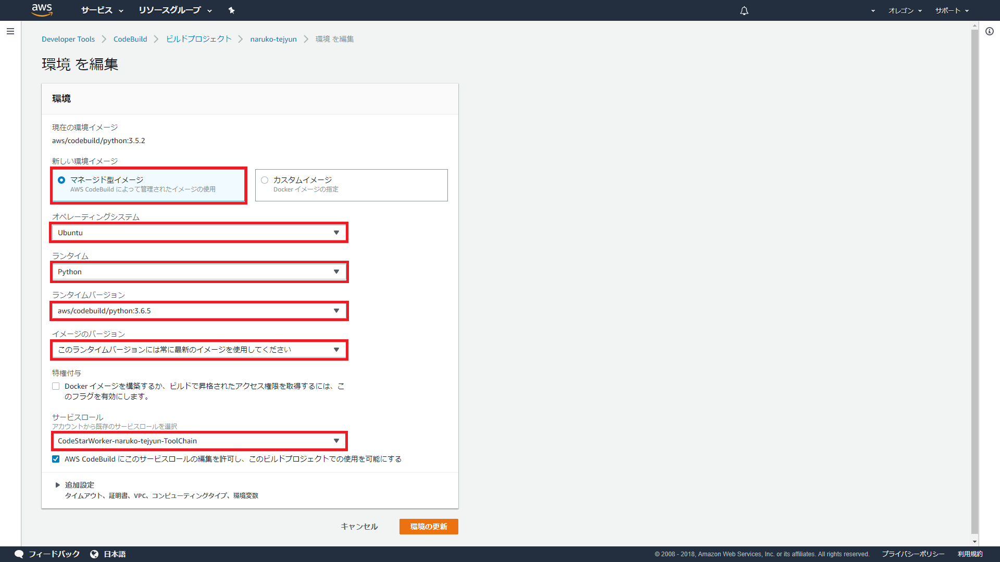

# 開発者向け構築

## はじめに
ここでは鳴子をカスタマイズして利用したい方や鳴子に貢献をしてくださる開発者の方々に向けた環境構築の手順を示します。
本手順を踏むことで、AWSのCodeStarを利用した検証環境、CI環境を作成することができます。

もし鳴子をカスタマイズすることなく利用することが目的の方は[環境構築](installation.md)を参照してください。

## 1.ファイルの修正<a name="file"></a>

[environment.config](https://github.com/crosspower/naruko/blob/master/.ebextensions/environment.config)  
以下の編集によって設定値を環境ごとに分けることができます。  
環境を分けずに開発する場合は編集する必要はありません。

```
 option_settings:
   - option_name: environment
-    value: prod
+    value: dev
```

[buildspec.yml](https://github.com/crosspower/naruko/blob/master/buildspec.yml)  
以下の編集によってmasterブランチへのPush時にテストコードを実行させることができます。
テストコードの実行が不要な場合は編集する必要はありません。

```
   pre_build:
     commands:
       # Discover and run unit tests. For more information, see <https://docs.djangoproject.com/en/2.0/topics/testing/overview/>
-      # - python manage.py test --settings config.settings.production
-      # - npm run test:unit
+       - python manage.py test --settings config.settings.production
+       - npm run test:unit
```

## 2.CodeStar

[環境構築](installation.md)の1.CodeStarを参照してください。

## 3.設定値の作成

[環境構築](installation.md)の2.設定値の作成を参照してください。  
それに加えて、各設定値キーの先頭に「DEV_」を加えたものを作成してください。 

「DEV_」の値は [ファイルの修正](#file)でenvironment.configを修正した環境で読み込まれます。（そうでない環境ではそのままのキーで設定値を読み込みます。）
またデプロイ時に実行されるテストコードでも「DEV_」がついた設定値を読み込みます。

## 4.SES設定

[環境構築](installation.md)の3.SESを参照してください。

## 5.Iamロールの設定

[環境構築](installation.md)の4.Iamロールの設定を参照してください。


## 6.CodeBuild

CodeStarからPythonの環境を作成した場合、CodeBuildのビルド環境は2018年12月28日時点でPython3.5.2が使用されているためCodeBuildの環境をPython3.6.5に変更します。  

この際そのまま変更しようとすると
```
「Role XXXXXXXXXXXXXXX trusts too many services, expected only 1.」
```
といったメッセージにより環境の更新が行えません。  

そのためCodeBuildに割り当てるロールをCodeBuildのみ信頼したものに再設定します。


### CodeBuild用Iamロール作成

信頼関係はCodeBuildのみを選択します。  
ここで作成したIamロールに**6.Iamロールの設定**で作成したポリシーをアタッチします。

またほかのポリシーについては「CodeStarWorker-{CodeStarのプロジェクト名}-ToolChain」にアタッチされているポリシーを参考に設定します。

### CodeBuild環境更新
CodeBuildの環境を以下のように編集します。  

オペレーティングシステムを「Ubuntu」  
ランタイムを「Python」  
ランタイムバージョンを「aws/codebuild/python:3.6.5」  
イメージのバージョンを「このランタイムバージョンには常に最新のイメージを使用してください」  

サービスロールを上記で作成したロールにします。



CodeBuildから接続するDBによってはここでVPCやサブネットの設定をする必要があります。  
参考：[AWS CodeBuildビルドからVPC内のリソースにアクセスする](https://aws.amazon.com/jp/blogs/devops/access-resources-in-a-vpc-from-aws-codebuild-builds/)

## 7.ソースコードの反映

[環境構築](installation.md)の5.ソースコードの反映を参照してください。

## 8. 動作確認

[環境構築](installation.md)の6.動作確認の設定を参照してください。
