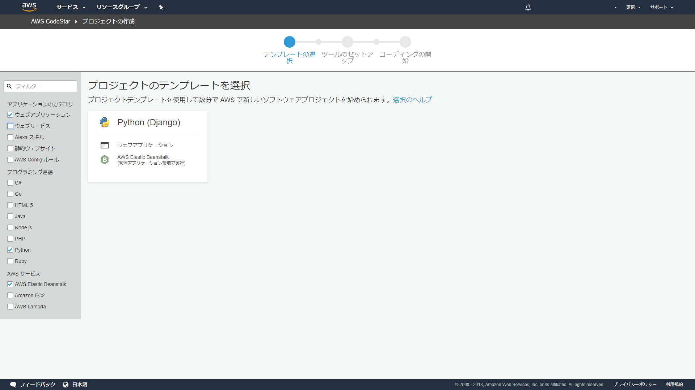
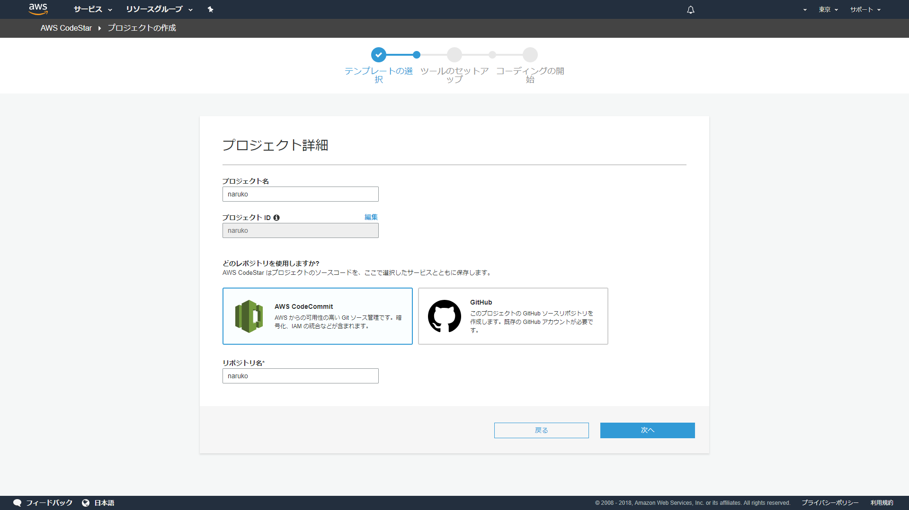
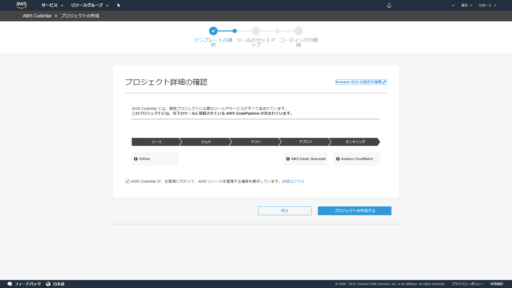
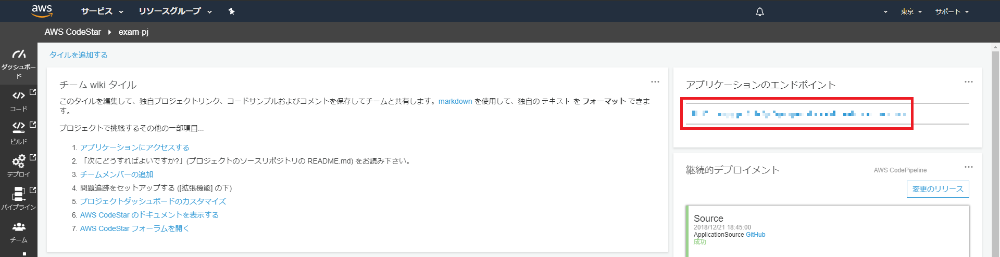
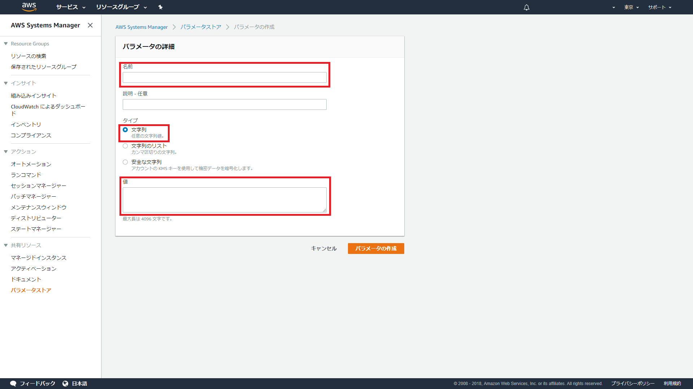
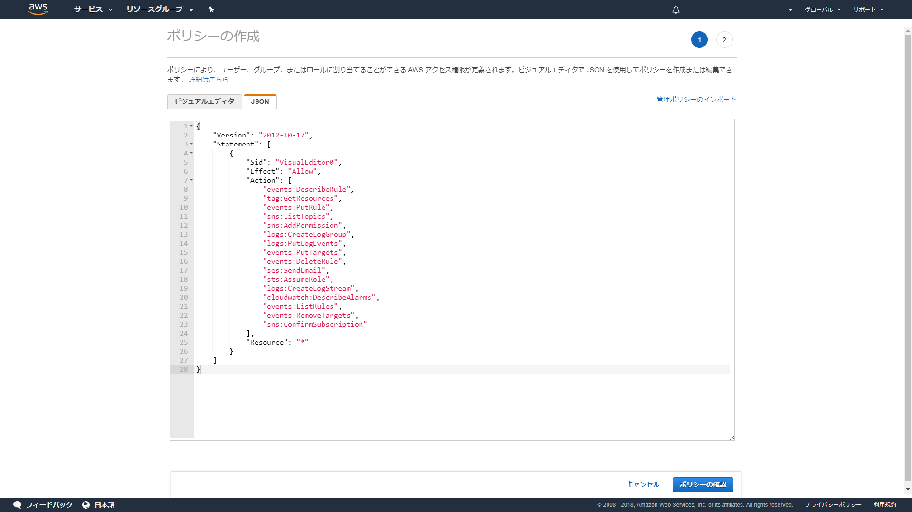
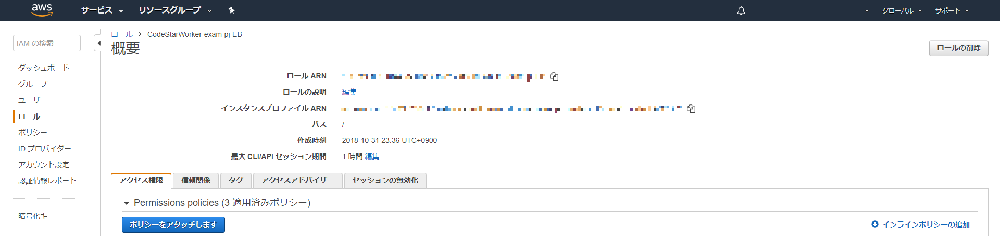
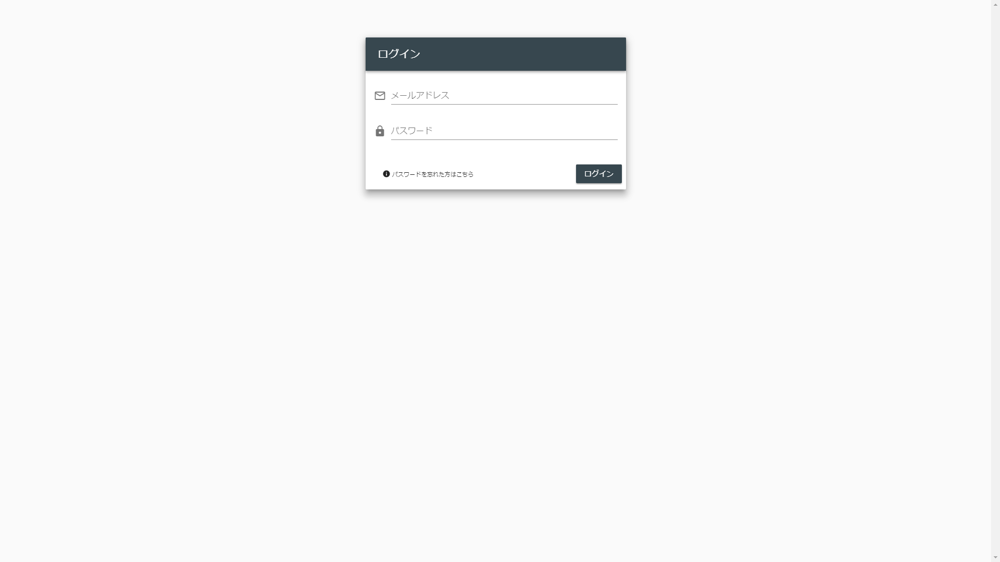
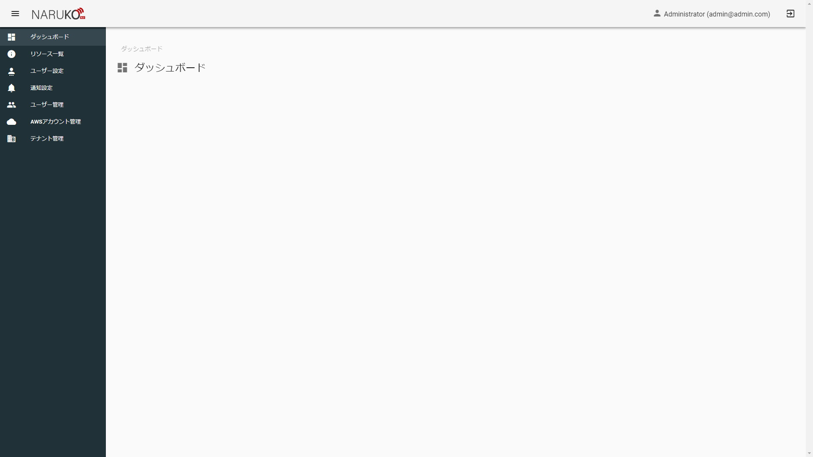

# 環境構築

## 前提事項
鳴子が動作するリージョンが東京リージョンであること（リージョンを変更する場合は事前に[リージョンの変更について](#region)を参照してください）
鳴子とDBが接続可能であること（RDSを使用する場合はRDS側のセキュリティグループの設定をしてください）

## 1.CodeStar

AWSのCodeStarからDjango用の環境を作成します。  
画像のようにPython（Django）のAWS Elastic Beanstalkが選ばれていることを確認してください。  


プロジェクト名は好きな名前を設定できます。  
リポジトリは好きな方を選ぶことができます。  


ここで実際にアプリケーションが動くEC2のインスタンスタイプやVPC、サブネットを設定できます。（後から設定しなおすことも可能です）  
プロジェクトを作成するを押してしばらくしたら作成完了です。  


CodeStarではダッシュボードから作成したアプリケーションの管理をすることができます。  
作成完了後にはエンドポイントが割り当てられるのでアクセスできるかどうか確認します。  
この時点ではCodeStarが自動的に作成した画面が表示されます。  


##  2.設定値の作成

鳴子ではアプリケーションで使用する設定値をAWSのSystemManagerにあるパラメータストアで管理しています。  
鳴子を作成したリージョンと**同じリージョン**でパラメータストアにパラメータを作成してください。  



設定値は以下のものがあります。  

| キー | 説明 |
| ------------- | ------------- |
| DEBUG  | デバッグ用 TrueまたはFalseを指定します |
| SES_ADDRESS  | SESで使用する送信用アドレス  |
| SES_REGION | 使用するSESのリージョン バージニア北部であれば「us-east-1」と設定します |
| LOG_GROUP | アプリケーションログの出力先となるCloudWatch Logsのロググループ名 |
|SNS_TOPIC_NAME  | 通知機能用のSNSトピック名 「NARUKO_NOTIFY」を設定してください。 |
| NOTIFY_TEXT_MESSAGE | 監視機能で送信される通知メールの本文および電話の読み上げ内容を設定します※ |
| NOTIFY_TEXT_SUBJECT | 監視機能で送信される通知メールの件名を設定します |
| EVENT_SNS_TOPIC_ARN | スケジュール機能用のSNSトピックARN 「arn:aws:sns:{鳴子を利用するリージョン}:{鳴子を利用するAWSアカウントのID}:NARUKO_SCHEDULE」を設定します。 |
| CONNECT_REGION | 電話通知機能用のAmazonConnectを使用するリージョン 東京であれば「ap-northeast-1」と設定します |
| CONNECT_NOTIFY_INSTANCE_ID | 電話通知機能用のAmazonConnectのインスタンスIDを設定します(後述) |
| CONNECT_NOTIFY_FLOW_ID | 電話通知機能用のAmazonConnectで使用する問い合わせフローのIDを設定します(後述) |
| CONNECT_PHONE_NUMBER | 電話通知機能用のAmazonConnectで使用する電話番号を設定します(後述) |
| DB_ENGINE | [Djangoのドキュメント](https://docs.djangoproject.com/ja/2.1/ref/settings/#engine) を参考に使用するDBのエンジンを設定します|
| DB_NAME | 使用するDBの名前を設定します（あらかじめ用意したDBをご利用ください） |
| DB_HOST | 使用するDBの接続先を設定します |
| DB_USER | 使用するDBのユーザー名を設定します |
| DB_PASSWORD | 使用するDBのパスワードを設定します |

※NOTIFY_TEXT_MESSAGEには以下の文字列({}を含む)を含めることで検知したアラートの詳細情報を記載することができます。  
　各文字列は監視検知の際に提供されるデータに対応しておりそれらを好きなものだけ組み合わせて自由に本文を定義することができます。  
　改行が必要な場合は「\n」で改行させることができます。  

| 文字列 | 説明 |
| ---- | ---- |
| {timestamp} | アラートを検知した時間 |
| {aws_name} | アラートを上げたリソースが所属するAWSアカウントの名前 |
| {aws_account_id} | アラートを上げたリソースが所属するAWSアカウントのID |
| {region} | アラートを上げたリソースが所属するリージョンの日本語名 |
| {service} | アラートを上げたリソースのサービス  EC2、RDS、ELB |
| {resource_id} | アラートを上げたリソースの識別子  EC2: インスタンスID  RDS: インスタンス識別子  ELB: ロードバランサー名 |
| {metrics} | アラート対象の監視項目 |
| {level} | アラートのレベル |

```
例：「鳴子からの監視検知のお知らせ\n\n{timestamp}に{aws_name}:{aws_account_id}の{region}における{service}:{resource_id}の{metrics}が{level}状態になりました」  
↓
鳴子からの監視検知のお知らせ


2018年12月01日 10時12分34秒にname:123456789012の東京リージョンにおけるEC2:i-xxxxxxxxxxxxxのネットワーク送信量が危険状態になりました
```

## 3.SES設定

鳴子ではAWSのSESを使用してメールを送信しています。  
SESでは初期状態では登録したメールアドレスでしか送受信を行うことができないため、[ドキュメント](https://docs.aws.amazon.com/ja_jp/ses/latest/DeveloperGuide/request-production-access.html)を参考にメールの受信はどのメールアドレスでも行えるように設定します。  
  
また、[ドキュメント](https://docs.aws.amazon.com/ja_jp/ses/latest/DeveloperGuide/verify-email-addresses-procedure.html)を参考に送信用のメールアドレスを設定します。  
ここで設定するメールアドレスは設定値の「SES_ADDRESS」と同じメールアドレスにしてください。  

## 4. Amazon Connect 設定

### インスタンス作成

鳴子ではAmazonConnectを利用して電話による通知をおこないます。  
[ドキュメント](https://docs.aws.amazon.com/ja_jp/connect/latest/adminguide/gettingstarted.html#launch-contact-center)を参考にAmazonConnectインスタンスを作成します。

**ステップ 1: ID 管理**では**Amazon Connect 内にユーザーを保存**を選択します。  
**ステップ 2: 管理者**では**これをスキップ**を選択します。  
**ステップ 3: テレフォニーオプション**では**発信通話**にのみチェックを入れます。  
**ステップ 4: データストレージ**ではデフォルトの設定のまま次に進みます。  
**ステップ 5: レビューと作成**で設定内容を確認し、インスタンスを作成します。

### 電話番号取得

インスタンス作成直後、**今すぐ始める**というボタンが表示されているのでそこを推すと電話番号を取得する画面が表示されます。  

電話番号はAmazonConnectから提供される好きな番号を利用できます。  
ここで取得した電話番号を設定値の「CONNECT_PHONE_NUMBER」に設定します。  
※「+81 50-1234-5678」なら「+815012345678」のようにスペースをハイフンを除いて設定します。


### 問い合わせフローの作成

電話通知用の問い合わせフローを作成します。  
問い合わせフローはあらかじめ作成したテンプレートデータをインポートして作成します。 
テンプレートデータは下記のjsonをご利用ください。   

```
{"modules":[{"id":"68d92ff0-eaed-48da-b578-ce100266c320","type":"PlayPrompt","branches":[{"condition":"Success","transition":"6ef88a5f-2165-4a33-86cc-1999db2e2181"}],"parameters":[{"name":"Text","value":"message","namespace":"User Defined"},{"name":"TextToSpeechType","value":"text"}],"metadata":{"position":{"x":908,"y":49},"useDynamic":true}},{"id":"7eeb0845-cd65-42b6-9ce0-5d830354351a","type":"Disconnect","branches":[],"parameters":[],"metadata":{"position":{"x":922,"y":242}}},{"id":"6ef88a5f-2165-4a33-86cc-1999db2e2181","type":"Loop","branches":[{"condition":"Looping","transition":"68d92ff0-eaed-48da-b578-ce100266c320"},{"condition":"Complete","transition":"7eeb0845-cd65-42b6-9ce0-5d830354351a"}],"parameters":[{"name":"LoopCount","namespace":"User Defined","value":"loop_count"}],"metadata":{"position":{"x":670,"y":39},"useDynamic":true}},{"id":"795ee0f8-2d69-4227-bc19-668cd328370d","type":"SetVoice","branches":[{"condition":"Success","transition":"6ef88a5f-2165-4a33-86cc-1999db2e2181"}],"parameters":[{"name":"GlobalVoice","value":"Mizuki"}],"metadata":{"position":{"x":424,"y":32}}},{"id":"a795007b-4714-4cfa-a593-70e1a4429991","type":"SetAttributes","branches":[{"condition":"Success","transition":"795ee0f8-2d69-4227-bc19-668cd328370d"},{"condition":"Error","transition":"795ee0f8-2d69-4227-bc19-668cd328370d"}],"parameters":[{"name":"Attribute","value":"success","key":"status","namespace":null}],"metadata":{"position":{"x":185,"y":30}}}],"version":"1","type":"contactFlow","start":"a795007b-4714-4cfa-a593-70e1a4429991","metadata":{"entryPointPosition":{"x":32,"y":31},"snapToGrid":false,"name":"naruko_notification","description":null,"type":"contactFlow","status":"published","hash":"3351c6c93afd0d0e2bea7ae1989f38d19613853c28629c5392e53a83d6e323d3"}}
```

問い合わせフローを保存するとブラウザで表示されるURLが以下のようになります。  
```
https://【ステップ1で入力した文字列】.awsapps.com/connect/contact-flows/edit?id=arn:aws:connect:【リージョン】:【AWSアカウントID】:instance/【インスタンスID】/contact-flow/【問い合わせフローID】
```

【インスタンスID】を設定値の「CONNECT_NOTIFY_INSTANCE_ID」に  
【問い合わせフローID】を設定値の「CONNECT_NOTIFY_FLOW_ID」に設定します。

## 5.Iamロールの設定

鳴子ではプログラム内で様々なAWSサービスを利用しています。  
本手順に従って動作環境を構築している場合、「CodeStarWorker-{CodeStarのプロジェクト名}-EB」ロールに適切な権限を割り当てる必要があります。  
  
IAMから鳴子用のポリシーを作成します。  
ポリシーには以下のjsonを設定してください。  

```
{
    "Version": "2012-10-17",
    "Statement": [
        {
            "Sid": "VisualEditor0",
            "Effect": "Allow",
            "Action": [
                "connect:StartOutboundVoiceContact",
                "events:DescribeRule",
                "tag:GetResources",
                "events:PutRule",
                "sns:CreateTopic",
                "sns:ListTopics",
                "ssm:GetParameters",
                "logs:CreateLogGroup",
                "logs:PutLogEvents",
                "sns:AddPermission",
                "events:PutTargets",
                "events:DeleteRule",
                "ses:SendEmail",
                "sts:AssumeRole",
                "logs:CreateLogStream",
                "cloudwatch:DescribeAlarms",
                "events:ListRules",
                "events:RemoveTargets",
                "sns:ConfirmSubscription"
            ],
            "Resource": "*"
        }
    ]
}
```



名前と説明を入力してポリシーを作成します。  


「CodeStarWorker-{CodeStarのプロジェクト名}-EB」に作成したポリシーをアタッチします。  



## 6.ソースコードの反映

CodeStarで作成されたリポジトリのmasterブランチに鳴子のソースコードをpushします。  
CodeStar上でアプリケーションの反映が完了したことが確認出来たらエンドポイントにアクセスします。  
以下のようなログイン画面が表示されることを確認します。  



## 7.動作確認

ログイン画面で  
メールアドレスに「admin@admin.com」  
パスワードに「Passw0rd!」  
と入力してログインボタンを押下します。  
  
ダッシュボードが表示されたら構築完了です。  
お疲れさまでした。  




## 初期データについて

ElasticBeanstalkを利用した環境では毎デプロイ時に自動的に初期データが投入されます。  
そのため編集された初期データはデプロイ時に初期のデータに戻ります。  
編集した初期データを使い続けたい場合は以下のファイルを編集してください。  

[initial_data.json](https://github.com/crosspower/exam-pj/blob/master/backend/fixtures/initial_data.json)

## リージョンの変更について<a name="region"></a>

鳴子を利用されるリージョンを変更したい場合、以下のファイルを編集する必要があります。  

[base.py](https://github.com/crosspower/exam-pj/blob/master/config/settings/base.py): 15行目  

```
NARUKO_REGION = "ap-northeast-1"
```