# 利用者マニュアル

## 用語説明

|用語|説明|
|---|---|
|テナント|鳴子内で管理・利用範囲を分離するために使用できるグループです。企業や部署、チームのように割り当てることができます。ユーザーやAWSアカウントなどはすべていずれかのテナントの配下におかれて管理・利用されることになり、テナント間でユーザーなどが共有されることはありません。|
|リソース|鳴子内で管理できるAWSの各サービスにおけるリソース全般を表します。例としてEC2インスタンスやRDSインスタンス等が挙げられます。|

## 初回導入

はじめて鳴子を利用される方向けの初回導入用の項です。  
各機能の詳細は省いてすぐに利用できるための手順を示します。

### 1. 初回ログイン

環境構築直後の鳴子には初期ユーザしか存在しないため初期ユーザーとしてログインし実際に使用するユーザーを作成します。

ログイン画面で  
メールアドレスに「admin@admin.com」  
パスワードに「Passw0rd!」  
と入力してログインボタンを押下します。

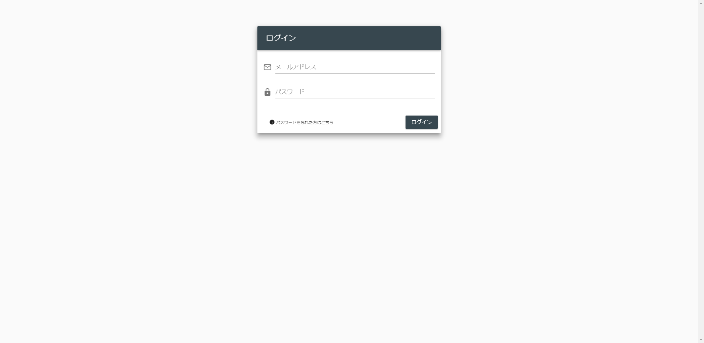

### 2. テナント作成

実際に利用するテナントを作成します。  
サイドメニューの`テナント管理`からテナント管理画面を開きます。  
テナント管理画面で`テナント登録ボタン`を押します。


各項目に必要な情報を入力し、`登録`を押します。

|項目|入力内容|
|---|---|
|テナント名|テナントの名前です。部署の名前やチーム名など利用する方に親しみのある名前をつけると意味がはっきりします。|
|メールアドレス|テナント全体のメールアドレスを登録します。|
|電話番号|テナント全体の電話番号を登録します。|
|初期ユーザー名|登録するテナントの初期ユーザーの名前です。|
|初期ユーザーメールアドレス|登録するテナントの初期ユーザーのメールアドレスです。|


登録が正常におこなえたら、`初期ユーザーメールアドレス`に入力したメールアドレス宛に初期ユーザー用のパスワードが送信されています。  
送信されたパスワードとメールアドレスで再度ログインしなおしてから次の手順を実施してください。

### 3. AWSアカウント登録

#### AWSマネジメントコンソール上での手順

鳴子で監視・運用したいAWSアカウントを登録します。  
はじめに鳴子からAWSアカウントを操作できるようにクロスアカウントの設定をおこないます。(この設定は鳴子が動作しているAWSアカウントを利用する場合でも実施する必要があります。)

下記を参考にクロスアカウントを作成します。  
作成時に設定するロール名、外部IDは後で使用するため控えておいてください。  
[チュートリアル: AWS アカウント間の IAM ロールを使用したアクセスの委任](https://docs.aws.amazon.com/ja_jp/IAM/latest/UserGuide/tutorial_cross-account-with-roles.html)

クロスアカウント用のロールに設定するポリシーは以下のようにします。

```
{
    "Version": "2012-10-17",
    "Statement": [
        {
            "Sid": "VisualEditor0",
            "Effect": "Allow",
            "Action": [
                "ec2:RebootInstances",
                "tag:GetResources",
                "ec2:DescribeInstances",
                "rds:DescribeDBSnapshots",
                "ec2:CreateImage",
                "ec2:StopInstances",
                "ec2:DescribeImages",
                "elasticloadbalancing:DescribeLoadBalancers",
                "cloudwatch:PutMetricAlarm",
                "iam:SimulatePrincipalPolicy",
                "ec2:StartInstances",
                "rds:CreateDBSnapshot",
                "rds:DescribeDBClusterSnapshots",
                "rds:DescribeDBInstances",
                "cloudwatch:DescribeAlarms",
                "rds:CreateDBClusterSnapshot",
                "cloudwatch:GetMetricData"
            ],
            "Resource": "*"
        }
    ]
}
```

#### 鳴子上での手順

実際に利用するAWSアカウントを登録します。  
サイドメニューの`AWSアカウント管理`からテナント管理画面を開きます。  
テナント管理画面で`AWSアカウント登録ボタン`を押します。

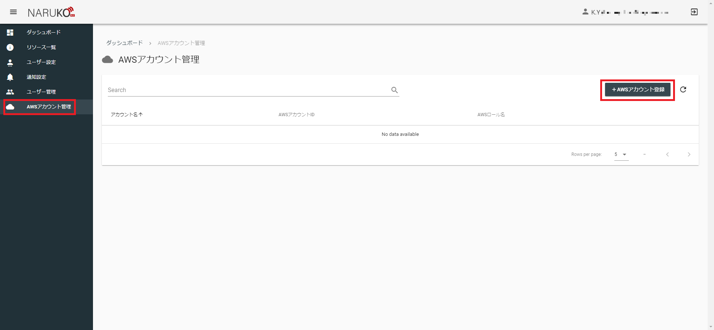

各項目に必要な情報を入力し、`登録`を押します。

|項目|入力内容|
|---|---|
|AWSアカウント名|AWSアカウントの名前です。登録するAWSアカウントの利用用途など好きな名前を付けることができます。|
|AWSアカウントID|登録するAWSアカウントのIDを登録します。|
|AWSロール名|クロスアカウントのロール名を登録します。|
|AWS外部ID|クロスアカウントの外部IDを登録します。|

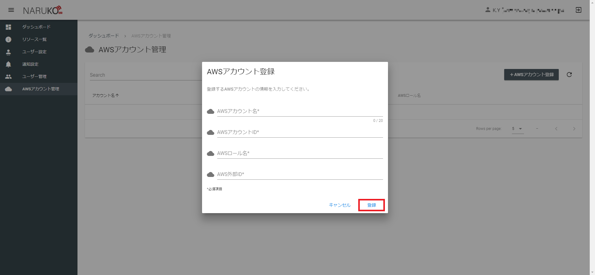

### 4. ユーザーとAWSアカウントの紐づけ

登録したAWSアカウントはユーザーと紐づけることで、各ユーザーが利用可能になります。

登録したAWSアカウントはユーザーと紐づける場合は、サイドメニューの`ユーザー管理`からユーザー管理画面を開きます。  


今回は自分自身にAWSアカウントを紐づけるように設定します。  
一覧に表示されている自身のユーザーの`編集ボタン`(鉛筆マーク)をクリックします。

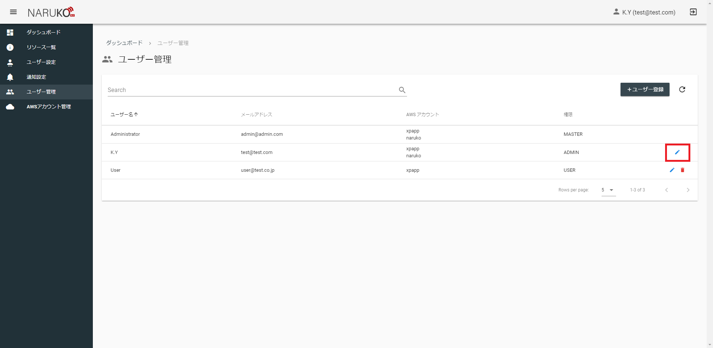

AWSアカウントで登録したAWSアカウントを選択します。  
選択後、`編集ボタン`を押します。

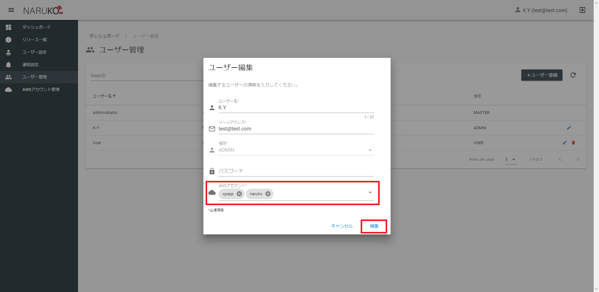

編集後、サイドメニューの`ダッシュボード`からダッシュボード画面を開きます。  
画面に登録したAWSアカウントが表示されていることを確認します。  

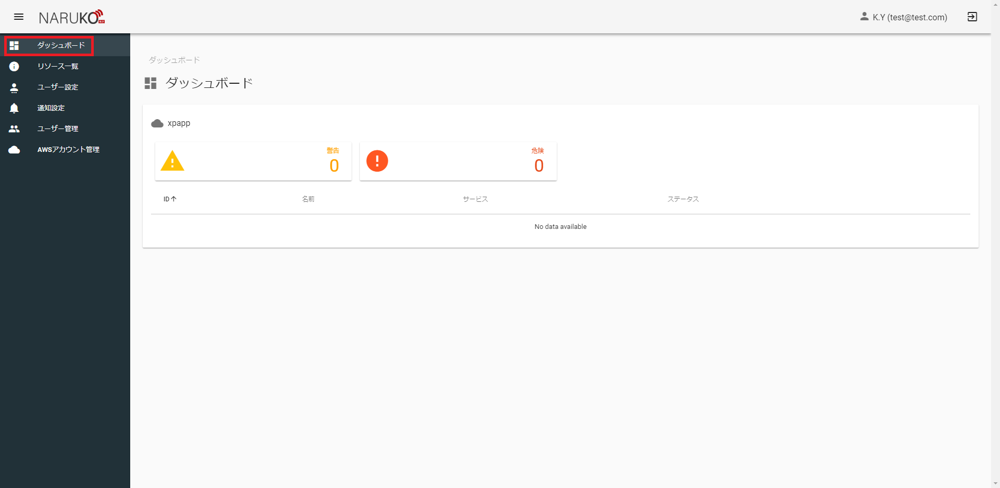

確認出来たら初期導入は終了です。  
鳴子を利用して監視や運用をすることができます。  
ここから先は自由に鳴子を使うことができます。

一通りの設定を順番に把握したい場合は、このまま通知設定、監視設定、スケジュール設定の順に読み進めてください。

## 通知設定<a name="notification"></a>

### 概要

通知設定画面では、通知先の登録と複数の通知先をまとめる通知グループを作成することができます。  
実際に監視対象からアラートが上がった時やスケジュールの実行成否の通知先は、AWSアカウントに紐づけた通知グループの中にある通知先となります。

### 操作方法

通知設定を利用する際は、サイドメニューの`通知設定`から通知設定画面を開きます。  

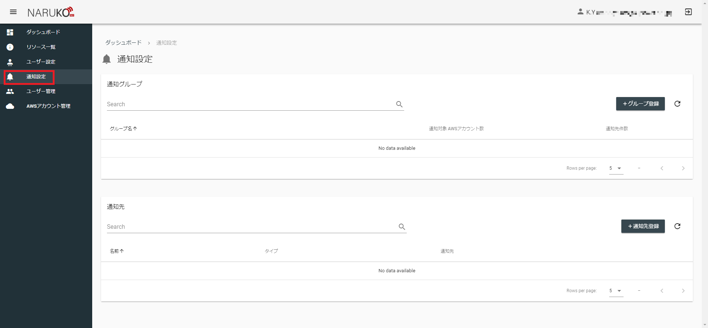

はじめに、通知グループに含める通知先を登録します。  
通知先を登録するときは`通知先登録ボタン`を押します。

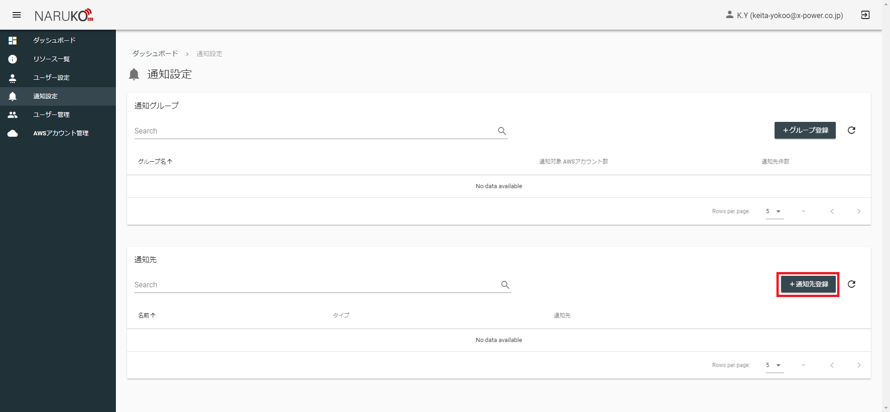

各項目に必要な情報を入力し、`登録`を押します。

|項目|入力内容|
|---|---|
|タイプ|通知の方法を選択します。選択したタイプによって`名前`より後の入力項目が追加されます。|
|名前|通知先の名前を登録します。わかりやすい好きな名前を付けることができます。|
|メールアドレス|タイプが`メール`のときに追加されます。通知先となるメールアドレスを設定します。|
|電話番号|タイプが`電話`の時に追加されます。通知先となる電話番号を設定します。日本の電話番号のみ設定できます。|


通知グループを作成するときは`グループ登録ボタン`を押します。

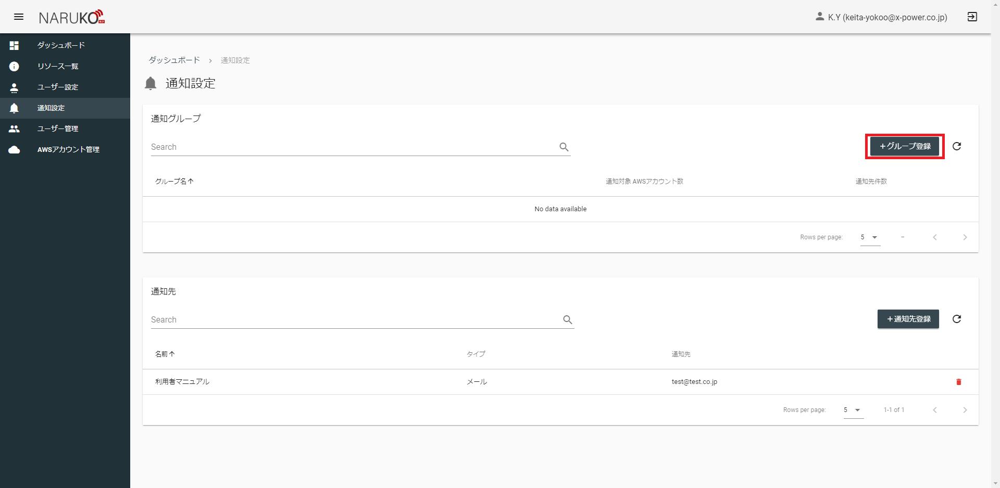

各項目に必要な情報を入力し、`登録`を押します。

|項目|入力内容|
|---|---|
|名前|通知グループの名前を登録します。わかりやすい好きな名前を付けることができます。|
|通知対象AWSアカウント|通知対象のAWSアカウントを任意の数選択します。すでに登録されているAWSアカウントが選択肢となります。|
|通知先|グループに含める通知先を任意の数選択します。すでに登録されている通知先が選択肢となります。|

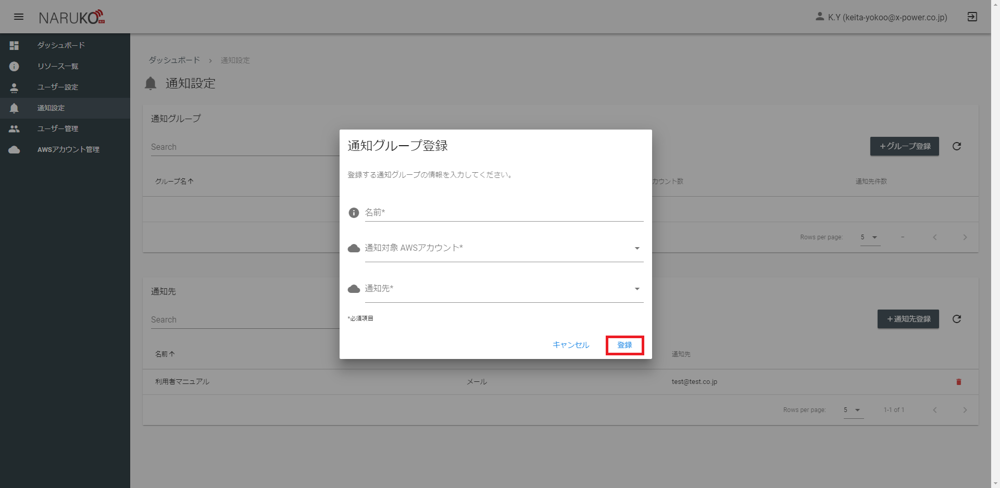


## 監視設定<a name="monitoring"></a>

### 概要

監視設定ではリソースに対してサービスに応じたメトリクスの監視設定をすることができます。  
監視設定をおこなうと、アラート発生時にリソースが属するAWSアカウントに紐づいた通知グループに通知が送られます。

### 操作方法

監視設定を利用する場合は、サイドメニューの`リソース一覧`からリソース一覧画面を開きます。
リソース一覧画面から監視設定したいリソースの虫眼鏡アイコンをクリックしリソース管理画面を開きます。

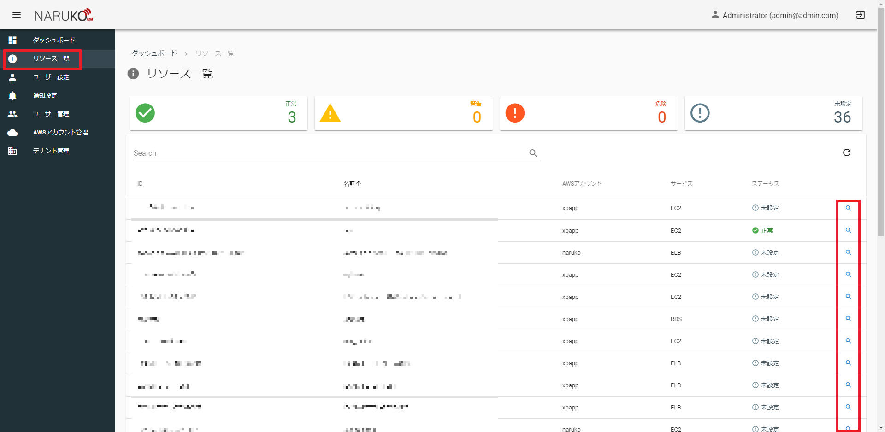

リソース管理画面で設定したいメトリクスの歯車アイコンをクリックします。

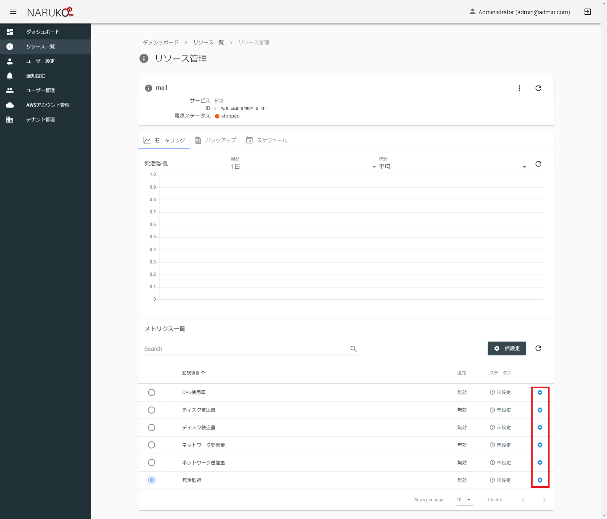

各項目に必要な情報を入力し、`登録`を押します。

|項目|入力内容|
|---|---|
|警告閾値|警告とする閾値を設定します。単位はメトリクスごとに変化します。|
|危険閾値|危険とする閾値を設定します。単位はメトリクスごとに変化します。|
|統計|閾値の判定に使う値の統計方法です。|
|間隔|閾値の判定に使う値の時間基準です。指定した時間の中での統計が閾値の判定に使用されます。|
|試行回数|閾値の判定に使う試行回数です。指定した回数分連続で閾値を超えるとアラートが発生します。|
|通知|通知をするかどうかを設定します。チェックを入れると警告・危険時に通知を送ります。|

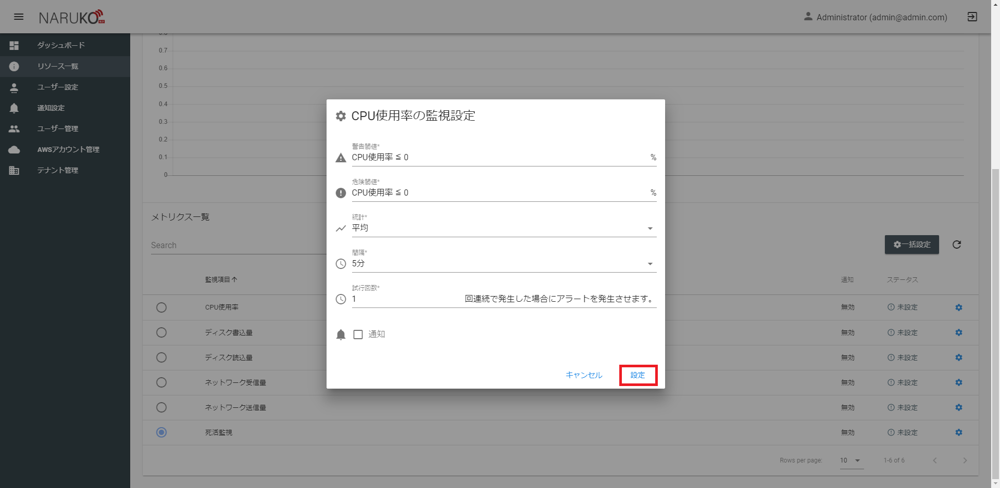
 
たとえば、統計が「平均」、間隔が「5分」、試行回数が「3回」のとき  
5分ごとの平均値が3回連続で閾値を超えるとアラートが発生します。

## スケジュール設定<a name="schedule"></a>

### 概要

スケジュール設定ではリソースに対して実行したいアクションの定期実行設定をすることができます。  

### 操作方法

スケジュール設定を利用する場合は、サイドメニューの`リソース一覧`からリソース一覧画面を開きます。
リソース一覧画面から監視設定したいリソースの虫眼鏡アイコンをクリックしリソース管理画面を開きます。


リソース一覧画面で`スケジュールタブ`をクリックします。

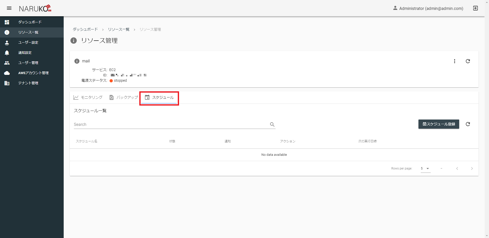

スケジュールメニューの中で`スケジュール登録ボタン`を押します。

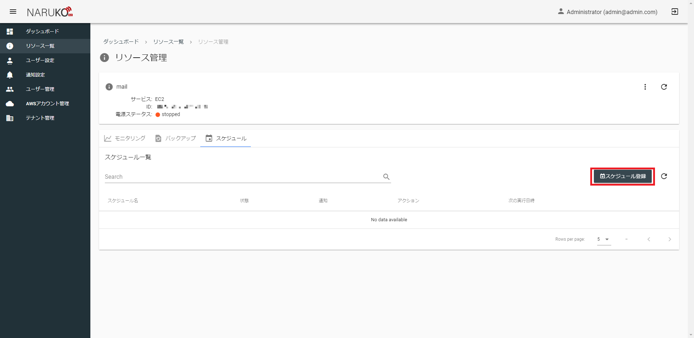

各項目に必要な情報を入力し、`次へ`を押します。

|項目|入力内容|
|---|---|
|スケジュール名|スケジュールの名前です。わかりやすい好きな名前を付けることができます。|
|有効|スケジュールを有効にするかどうかを設定します。チェックを入れるとスケジュールが定期的に実行されるようになります。|
|実行結果を通知する|実行結果の通知をするかどうかを設定します。チェックを入れるとスケジュール実行後に実行結果が通知されます。（メールのみ）|


各項目に必要な情報を入力し、`次へ`を押します。

|項目|入力内容|
|---|---|
|アクション|スケジュール実行したいアクションを選択します。選択したアクションによっては追加の入力項目があります。|

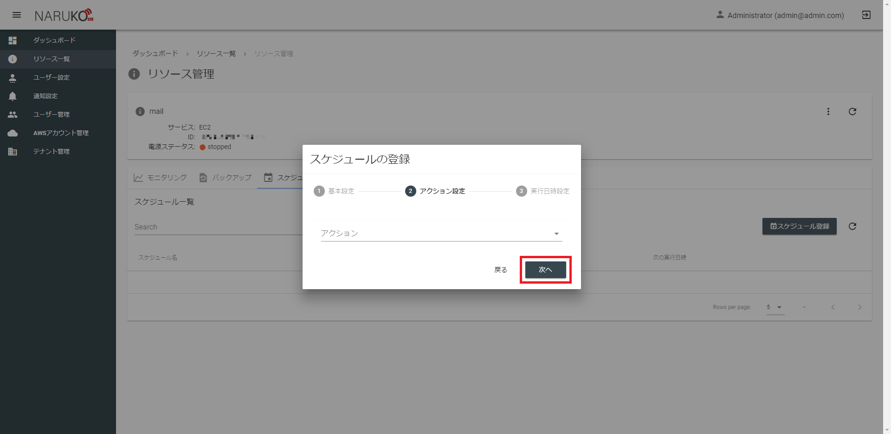

各項目に必要な情報を入力し、`登録`を押します。

|項目|入力内容|
|---|---|
|スケジュールタイプ|スケジュールの方式を選択します。選択したスケジュールタイプによっては追加の入力項目があります。|
|予定月|スケジュールタイプが`月指定`の時に追加されます。実行したい月を選択します。|
|予定日|スケジュールタイプが`月指定`の時に追加されます。実行したい日にちを選択します。存在しない月日の組み合わせでは実行されません。|
|予定曜日|スケジュールタイプが`曜日指定`の時に追加されます。実行したい曜日を選択します。|
|予定時刻|実行したい時間を時刻と分を指定して選択します。|

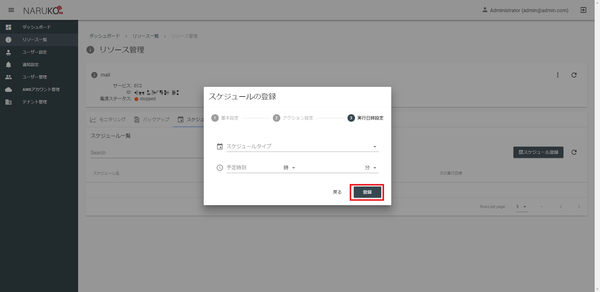

## テナント管理<a name="tenant"></a>

### 概要

テナントとは、鳴子内で管理・利用範囲を分離するために使用できるグループです。  
鳴子で管理されるユーザーやAWS上のリソースはすべてテナントに属します。  

すべてのユーザーは自身が属するテナント内のユーザーやAWSアカウントにしかアクセスすることができません。

### 操作方法

テナント管理を利用する場合は、サイドメニューの`テナント管理`からテナント管理画面を開きます。


テナントを登録するときは、`テナント登録ボタン`を押します。
各項目に必要な情報を入力し、`登録`を押します。

|項目|入力内容|
|---|---|
|テナント名|テナントの名前です。部署の名前やチーム名など利用する方に親しみのある名前をつけると意味がはっきりします。|
|メールアドレス|テナント全体のメールアドレスを登録します。|
|電話番号|テナント全体の電話番号を登録します。|
|初期ユーザー名|登録するテナントの初期ユーザーの名前です。|
|初期ユーザーメールアドレス|登録するテナントの初期ユーザーのメールアドレスです。|


テナントを登録すると、初期ユーザーメールアドレスに登録したメールアドレスにログイン用のパスワードが通知されます。  
また、このとき作成されるユーザーはADMIN権限となります。

## AWSアカウント管理<a name="aws"></a>

### 概要

鳴子で利用するAWSアカウントを管理することができます。  
この機能で管理することができるAWSアカウントは、ログインユーザーが属するテナント内のAWSアカウントのみとなります。  
テナント間で同じAWSアカウントを管理することはできません。

鳴子ではクロスアカウントを利用して管理対象のAWSアカウントの権限を鳴子に委譲します。  
作成するクロスアカウントでは以下のポリシーをもつようにしてください。  

```
{
    "Version": "2012-10-17",
    "Statement": [
        {
            "Sid": "VisualEditor0",
            "Effect": "Allow",
            "Action": [
                "ec2:RebootInstances",
                "tag:GetResources",
                "ec2:DescribeInstances",
                "rds:DescribeDBSnapshots",
                "ec2:CreateImage",
                "ec2:StopInstances",
                "ec2:DescribeImages",
                "elasticloadbalancing:DescribeLoadBalancers",
                "cloudwatch:PutMetricAlarm",
                "iam:SimulatePrincipalPolicy",
                "ec2:StartInstances",
                "rds:CreateDBSnapshot",
                "rds:DescribeDBClusterSnapshots",
                "rds:DescribeDBInstances",
                "cloudwatch:DescribeAlarms",
                "rds:CreateDBClusterSnapshot",
                "cloudwatch:GetMetricData"
            ],
            "Resource": "*"
        }
    ]
}
```

### 操作方法

AWSアカウント管理を利用する場合は、サイドメニューの`AWSアカウント管理`からAWSアカウント管理画面を開きます。  
AWSアカウントを登録する場合は、AWSアカウント管理画面で`AWSアカウント登録ボタン`を押します。

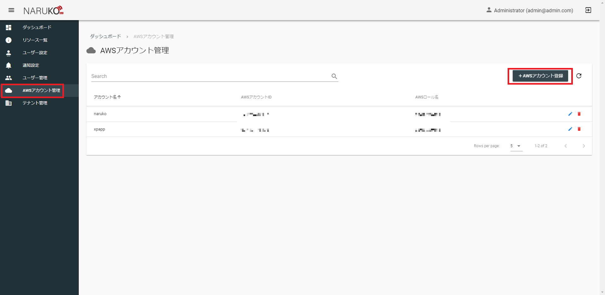

各項目に必要な情報を入力し、`登録`を押します。

|項目|入力内容|
|---|---|
|AWSアカウント名|AWSアカウントの名前です。登録するAWSアカウントの利用用途など好きな名前を付けることができます。|
|AWSアカウントID|登録するAWSアカウントのIDを登録します。|
|AWSロール名|クロスアカウントのロール名を登録します。|
|AWS外部ID|クロスアカウントの外部IDを登録します。|


## ユーザー管理<a name="user"></a>

### 概要

ユーザーには3種類の権限があります。

|権限|説明|
|---|---|
|USER|一般ユーザーです。上位権限を持つユーザーから与えられたAWSアカウント内のリソースの管理・操作ができます。|
|ADMIN|テナントの管理ユーザーです。USER権限に加え、テナント全体にまたがる操作（通知設定、ユーザー管理、AWSアカウント管理など）がおこなえます。|
|MASTER|システムの管理ユーザーです。ADMIN権限に加え、システム全体にまたがる操作（テナント管理など）がおこなえます。|

このうちユーザー管理をすることができる権限はADMINとMASTERとなり、それぞれ自分以下の権限をもったユーザーを作成することができます。  
各テナントではADMIN権限（MASTER権限がいればMASTER権限も）ユーザーが1人以上存在する必要があります。  
そのため、ADMIN権限をもった最後のユーザーは削除することができません。

### 操作方法

ユーザー管理を利用する場合は、サイドメニューの`ユーザー管理`からユーザー管理画面を開きます。  
ユーザーを登録する場合は、ユーザー管理画面で`ユーザー登録ボタン`を押します。


各項目に必要な情報を入力し、`登録`を押します。

|項目|入力内容|
|---|---|
|ユーザー名|ユーザーの名前です。好きな名前を付けることができます。|
|メールアドレス|ログイン用のメールアドレスです。パスワードリセット時の通知先となるため有効なメールアドレスを入力してください。|
|権限|ユーザーに設定する権限を選択します。|
|パスワード|ログイン用のパスワードです。|
|パスワードの確認|ログイン用のパスワード（確認）です。|
|AWSアカウント|ユーザーが利用できるAWSアカウントを選択します。すでに登録されているAWSアカウントが選択肢となります。|

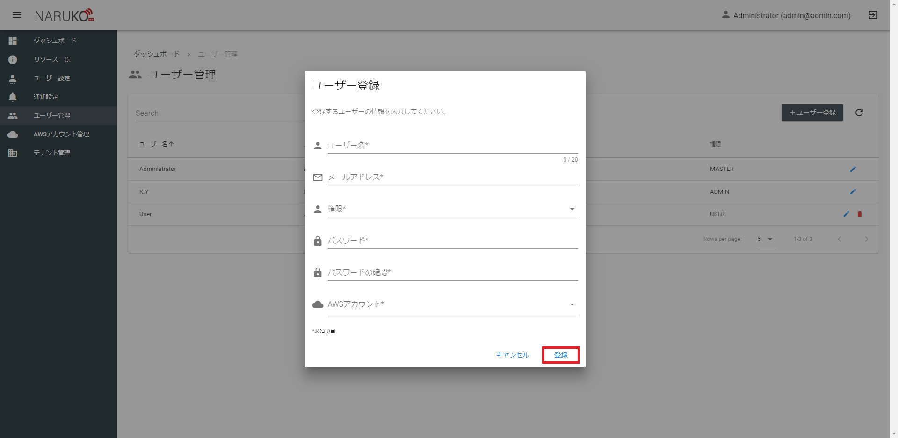

## ユーザー設定<a name="profile"></a>

### 概要

ログインユーザーの個人設定を編集することができます。  
パスワードの変更をおこなう場合はこの機能を利用します。

### 操作方法

ユーザー設定を利用する場合は、サイドメニューの`ユーザー設定`からユーザー設定画面を開きます。  
そのまま編集したい項目を編集して`更新ボタン`を押します。

|項目|入力内容|
|---|---|
|ユーザー名|ユーザーの名前です。好きな名前を付けることができます。|
|メールアドレス|ログイン用のメールアドレスです。パスワードリセット時の通知先となるため有効なメールアドレスを入力してください。|
|パスワード|ログイン用のパスワードです。|
|パスワードの確認|ログイン用のパスワード（確認）です。|

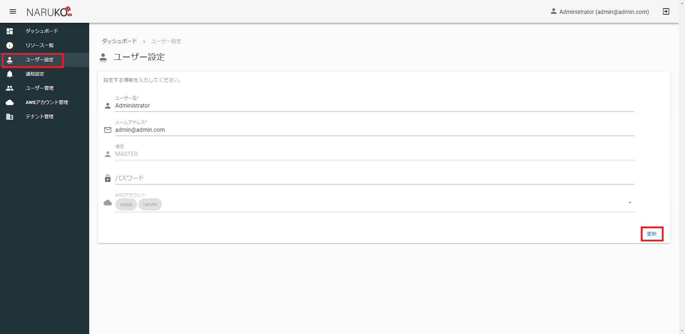
